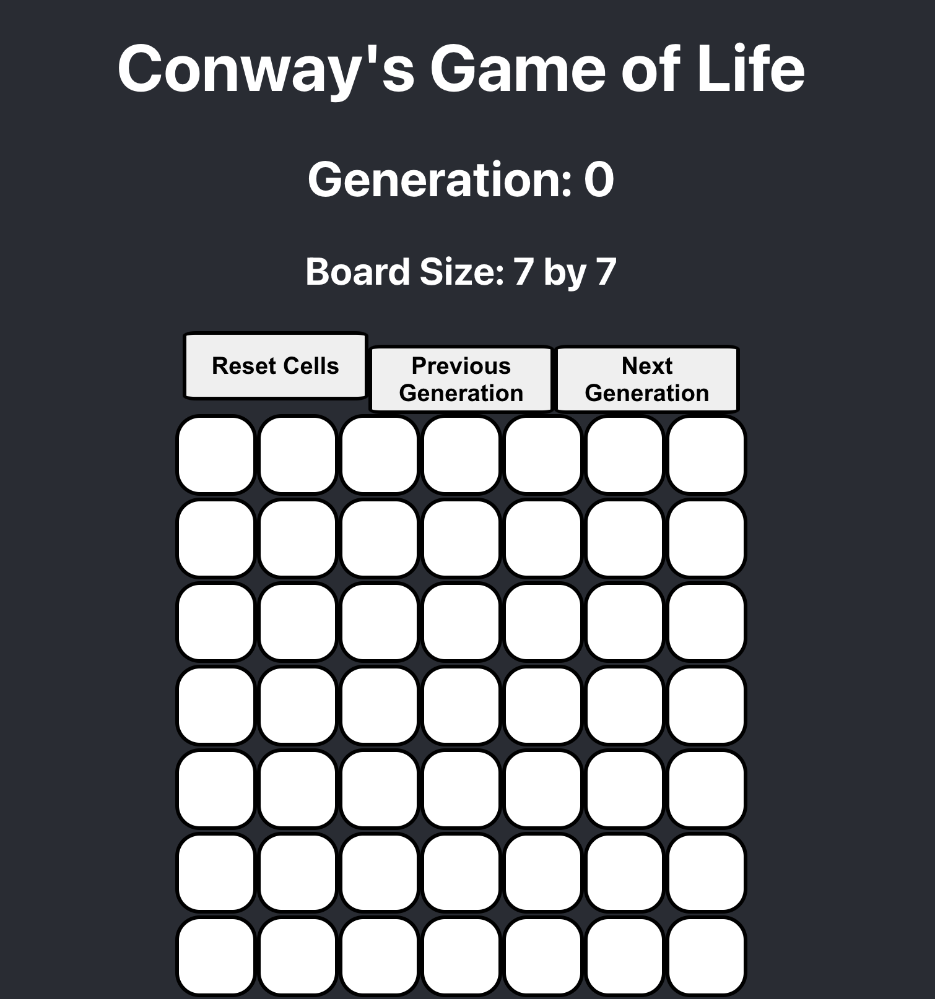

# Conway's Game of Life

This is my first React.js Front-end web application. The interface is quite simple and it implements Conway's Game of Life. Enjoy and please, if you so happen to go peek my code, leave a review so I can get better at understanding bloody functional programming.

Here is a preview of what the rendered web-page looks like.
