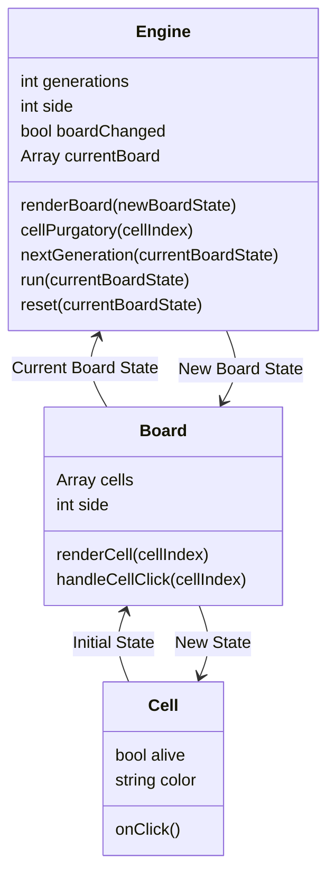

## UML of the Conway's Game of Life Front-End App

```mermaid
classDiagram
Engine <-- Board : Current Board State
Engine --> Board : New Board State
Board <-- Cell : Initial State
Board --> Cell : New State
Cell : bool alive
Cell : string color
Cell : onClick()
Board : Array cells
Board : int side
Board : renderCell(cellIndex)
Board : handleCellClick(cellIndex)
Engine : renderBoard(newBoardState)
Engine : int generations
Engine : int side
Engine : bool boardChanged
Engine : Array currentBoard
Engine : cellPurgatory(cellIndex)
Engine : nextGeneration(currentBoardState)
Engine : run(currentBoardState)
Engine : reset(currentBoardState)
```